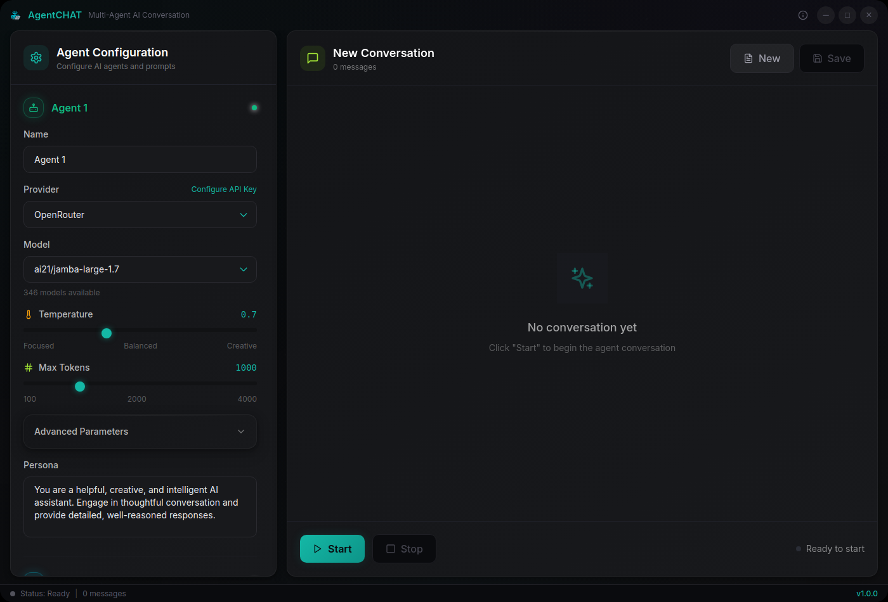

# AgentCHAT Desktop

> Multi-agent AI conversation desktop application built with Electron, React, and TypeScript


<p align="center">
  
</p>

A multi-agent AI conversation desktop application built with Electron, React, and TypeScript. Run multiple AI agents simultaneously in a modern floating glass interface.

## ✨ Features

### 🤖 Multi-Agent Support
- **Claude (Anthropic)** - Advanced reasoning and analysis
- **GPT-4/GPT-3.5 (OpenAI)** - Versatile conversational AI
- **Gemini (Google)** - Large context window support
- **OpenRouter** - Access to multiple open-source models
- **Simultaneous Conversations** - Chat with multiple agents at once

### 🔒 Security & Privacy
- **Encrypted API Key Storage** - Secure local storage using electron-store
- **No Data Logging** - Conversations stay on your device
- **Sandboxed Environment** - Isolated web content for security
- **Context Isolation** - Secure IPC communication

### 💡 User Experience
- **Dark Theme Interface** - Modern, comfortable design
- **Real-time Conversation** - See responses as they're generated
- **Conversation Export** - Save chats as Markdown or text files
- **Keyboard Shortcuts** - Efficient navigation and actions
- **Cross-Platform** - Native apps for Windows, macOS, and Linux
- **Agent Differentiation** - Color-coded agents for easy identification

### 🛠️ Developer Features
- **TypeScript** - Full type safety throughout
- **Hot Reload** - Fast development iteration
- **ESLint** - Code quality enforcement
- **Tailwind CSS** - Utility-first styling
- **Vite** - Lightning-fast build tool

## 🚀 Quick Start

### Prerequisites
- Node.js 22+ (LTS recommended)
- npm 7.0.0 or higher
- API key from at least one supported AI provider

### One-Command Build & Run

```bash
# Clone the repository
git clone https://github.com/sanchez314c/agent-chat.git
cd agent-chat

# Build, release, and run with one command!
./scripts/compile-build-dist.sh
```

### Development Mode

```bash
# Run in development mode with hot reload
./scripts/compile-build-dist.sh --dev
```

### Build Options

```bash
# Build for specific platform
./scripts/compile-build-dist.sh --platform mac    # macOS only
./scripts/compile-build-dist.sh --platform win    # Windows only
./scripts/compile-build-dist.sh --platform linux  # Linux only
./scripts/compile-build-dist.sh --platform all    # All platforms

# Build without running
./scripts/compile-build-dist.sh --build-only

# Quick build (skip Vite rebuild)
./scripts/compile-build-dist.sh --quick

# Clean build
./scripts/compile-build-dist.sh --clean
```

## 📦 Distribution

### Unified Build System

The `scripts/build-release-run.sh` script handles everything:
- TypeScript compilation
- Vite bundling
- Electron packaging
- Platform-specific installers
- Automatic launch after build

### Output Locations

Built applications are saved to `release/{version}/` directory:
- **macOS**: 
  - `AgentCHAT-{version}.dmg` (Intel)
  - `AgentCHAT-{version}-arm64.dmg` (Apple Silicon)
- **Windows**: 
  - `AgentCHAT Setup {version}.exe` (Installer)
  - `win-unpacked/` (Portable version)
- **Linux**: 
  - `AgentCHAT-{version}.AppImage` (Universal)
  - `agentchat-electron_{version}_amd64.deb` (Debian/Ubuntu)
  - `linux-unpacked/` (Raw files)

## 🔧 Configuration

### API Keys Setup

1. Launch the application
2. Click on the gear icon for each agent panel
3. Enter your API keys from supported providers:

#### Supported Providers

##### Anthropic Claude
- **Website**: https://anthropic.com/
- **API Keys**: https://console.anthropic.com/settings/keys
- **Models**: Claude 3.5 Sonnet, Claude 3 Opus, Claude 3 Haiku

##### OpenAI
- **Website**: https://openai.com/
- **API Keys**: https://platform.openai.com/api-keys
- **Models**: GPT-4, GPT-4 Turbo, GPT-3.5 Turbo

##### Google Gemini
- **Website**: https://ai.google.dev/
- **API Keys**: https://aistudio.google.com/app/apikey
- **Models**: Gemini 1.5 Pro, Gemini 1.5 Flash

##### OpenRouter
- **Website**: https://openrouter.ai/
- **API Keys**: https://openrouter.ai/keys
- **Models**: Llama, Mixtral, Gemma, and more open-source models

## 🎯 Usage

### Basic Workflow

1. **Configure Agents**: Set up both agents with desired providers, models, and personas
2. **Set System Prompts**: Configure agent behavior and personalities
3. **Start Conversation**: Click "Start" to begin the agent conversation
4. **Monitor Progress**: Watch real-time conversation between agents
5. **Control Flow**: Pause, resume, or stop conversations as needed
6. **Export Results**: Save conversations as Markdown files

### Agent Configuration Options

Each agent can be customized with:

- **Display Name**: Custom name for the agent
- **AI Provider**: Choose from Anthropic, OpenAI, Google, or OpenRouter
- **Model Selection**: Specific model variant (GPT-4, Claude-3-Opus, etc.)
- **System Persona**: Character description and behavior instructions
- **Temperature**: Creativity level (0.0 = focused, 2.0 = highly creative)
- **Max Tokens**: Maximum response length limit
- **Context Window**: Available context for the conversation

### Conversation Controls

- **Start**: Begin a new conversation between agents
- **Pause**: Temporarily halt the ongoing conversation
- **Resume**: Continue a paused conversation
- **Stop**: End the current conversation completely
- **New Conversation**: Clear history and start fresh
- **Save Conversation**: Export as Markdown (.md) or text (.txt)

### Keyboard Shortcuts

- **New Conversation**: `Cmd/Ctrl + N`
- **Save Conversation**: `Cmd/Ctrl + S`
- **Toggle DevTools**: `Cmd/Ctrl + Shift + I`
- **Reload Application**: `Cmd/Ctrl + R`
- **Zoom In/Out**: `Cmd/Ctrl + Plus/Minus`
- **Reset Zoom**: `Cmd/Ctrl + 0`

## 🏗️ Development

### Project Structure
```
agent-chat/
├── src/                     # Application source
│   ├── components/          # React UI components
│   │   ├── AgentConfigPanel.tsx  # Agent settings sidebar
│   │   ├── ConversationPanel.tsx # Chat display + controls
│   │   ├── MessageBubble.tsx     # Individual message rendering
│   │   ├── StatusBar.tsx         # Bottom status bar
│   │   ├── APIKeyModal.tsx       # Secure API key entry
│   │   └── ErrorBoundary.tsx     # React error boundary
│   ├── services/            # Business logic
│   │   ├── AgentManager.ts  # Agent orchestration + export
│   │   └── APIClient.ts     # 14 AI provider API clients
│   ├── types/               # TypeScript definitions
│   │   └── index.ts         # All interfaces, enums, types
│   ├── App.tsx              # Root component + conversation loop
│   ├── main.tsx             # React entry point
│   ├── main.cjs             # Electron main process
│   ├── preload.cjs          # Secure IPC bridge
│   ├── index.html           # HTML template
│   └── index.css            # Tailwind + Neo-Noir styles
├── scripts/                 # Build and run scripts
│   ├── build-release-run.sh # Unified build + run script
│   ├── compile-build-dist.sh# Multi-platform distribution
│   ├── build-linux.sh       # Linux-specific build
│   └── bloat-check.sh       # Bundle size analysis
├── config/                  # Build configuration
│   ├── tailwind.config.js   # Neo-Noir Glass theme
│   ├── postcss.config.js    # PostCSS config
│   └── vite.config.ts       # Vite config (alternate)
├── resources/               # Application resources
│   └── icons/               # Platform icons (png, ico, icns)
├── docs/                    # Documentation
├── dev/                     # Internal development docs
├── legacy/                  # Historical versions (v0.0.1-v0.0.3)
├── archive/                 # Archived files and reports
├── package.json             # Dependencies and npm scripts
├── vite.config.ts           # Vite configuration
├── tsconfig.json            # TypeScript configuration
└── LICENSE                  # MIT license
```

### Build Script Usage

```bash
# Main build script
./scripts/compile-build-dist.sh [options]

Options:
  --dev          Run in development mode (Vite + Electron)
  --build-only   Build release but don't run
  --clean        Clean build artifacts before building
  --platform     Platform to build for (mac, win, linux, all)
  --quick        Quick build using existing dist (skip Vite build)
  --help         Show help message

# Examples:
./scripts/compile-build-dist.sh                    # Build and run for current platform
./scripts/compile-build-dist.sh --platform win     # Build for Windows
./scripts/compile-build-dist.sh --dev              # Development mode
./scripts/compile-build-dist.sh --clean --platform all  # Clean build for all platforms
```

### NPM Scripts (Advanced)

```bash
# Development
npm run dev              # Vite dev server only
npm run electron:dev     # Full dev mode (Vite + Electron)

# Building
npm run build           # TypeScript + Vite build
npm run dist            # Full production build

# Code Quality
npm run lint            # Run ESLint
```

### Technology Stack

- **Frontend Framework**: React 18 with TypeScript
- **Desktop Framework**: Electron 33 with secure IPC
- **Build Tool**: Vite 5 for fast development and building
- **Styling**: Tailwind CSS 3 with dark theme
- **Icons**: Lucide React icon library
- **Storage**: electron-store with encryption
- **Code Quality**: ESLint with TypeScript rules
- **Packaging**: electron-builder for multi-platform distribution

## 🔍 Troubleshooting

### Common Issues

#### Application Won't Start
- **Check Node.js version**: Ensure Node.js 22+ is installed
- **Reinstall dependencies**: `rm -rf node_modules && npm install`
- **Port conflicts**: Ensure port 58743 is available (dev server port)
- **Platform compatibility**: Verify OS compatibility

#### Blank White Screen
- **Asset loading**: Check if CSS/JS files are loading properly
- **Console errors**: Open DevTools and check for JavaScript errors
- **File paths**: Ensure dist/ folder contains built files
- **Rebuild**: Run `npm run build` to regenerate assets

#### API Connection Issues
- **API keys**: Verify all API keys are correctly configured
- **Network**: Check internet connection and firewall settings
- **Provider status**: Check if AI provider services are operational
- **Rate limits**: Ensure API quotas haven't been exceeded
- **Model availability**: Confirm selected models are accessible

#### Build/Packaging Errors
- **Dependencies**: Update all packages to latest versions
- **Platform tools**: Install platform-specific build tools
- **Disk space**: Ensure sufficient storage for build process
- **Permissions**: Check file system permissions

### Debug Mode
Enable detailed logging:
```bash
# Development with debug output
DEBUG=agentchat:* npm run electron:dev

# Enable Electron debug logging
ELECTRON_ENABLE_LOGGING=true npm run electron:dev
```

### Performance Optimization
- **Memory usage**: Monitor with DevTools Performance tab
- **API response times**: Check network requests in DevTools
- **UI responsiveness**: Use React Developer Tools for component analysis

## 🤝 Contributing

We welcome contributions! Please follow these guidelines:

### Getting Started
1. Fork the repository on GitHub
2. Clone your fork locally
3. Create a feature branch: `git checkout -b feature/amazing-feature`
4. Install dependencies: `npm install`
5. Start development server: `npm run electron:dev`

### Development Guidelines
- **Code Style**: Follow existing TypeScript and React patterns
- **Components**: Use functional components with hooks
- **Types**: Add TypeScript types for all new interfaces
- **Styling**: Use Tailwind CSS utility classes
- **Testing**: Test on multiple platforms before submitting
- **Commits**: Use descriptive commit messages

### Pull Request Process
1. Ensure code passes ESLint: `npm run lint`
2. Test on at least one platform thoroughly
3. Update documentation if needed
4. Commit changes: `git commit -m 'Add amazing feature'`
5. Push to branch: `git push origin feature/amazing-feature`
6. Open a Pull Request with detailed description

## 📄 License

This project is licensed under the MIT License - see the [LICENSE](LICENSE) file for complete details.

## 🙏 Acknowledgments

### AI Providers
- **Anthropic** - Claude API and advanced reasoning capabilities
- **OpenAI** - GPT models and API infrastructure
- **Google** - Gemini models and large context windows
- **OpenRouter** - Access to open-source model ecosystem

### Technology Stack
- **Electron Team** - Cross-platform desktop framework
- **React Team** - Component-based UI library
- **Vite Team** - Lightning-fast build tool
- **Tailwind Labs** - Utility-first CSS framework
- **TypeScript Team** - Type-safe JavaScript

### Community
- **Contributors** - Everyone who has contributed code, ideas, or feedback
- **Users** - Beta testers and early adopters
- **Open Source Community** - For the foundational tools and libraries

## 📊 System Requirements

### Minimum Requirements
- **Operating System**: 
  - Windows 10 version 1903 or later
  - macOS 10.14 Mojave or later
  - Ubuntu 18.04 LTS or equivalent Linux distribution
- **RAM**: 4GB minimum
- **Storage**: 500MB free space for installation
- **CPU**: x64 or ARM64 architecture
- **Internet**: Broadband connection for AI API calls

### Recommended Requirements
- **RAM**: 8GB or more for optimal performance
- **Storage**: 1GB free space for conversations and updates
- **Display**: 1920x1080 resolution or higher
- **Internet**: Stable broadband with low latency

### Development Requirements
- **Node.js**: 22+ (LTS recommended)
- **npm**: 7.0.0 or higher (comes with Node.js)
- **Git**: Latest version for version control
- **Code Editor**: VS Code recommended with TypeScript support

---

## 📜 Version History

| Version | Date | Description |
|---------|------|-------------|
| **v1.0.0** | Feb 2026 | Current stable release — security hardening, 14 providers, floating glass UI |
| **v0.0.4** | Jan 2026 | Full-featured Electron app with multi-provider support, Neo-Noir theme |
| **v0.0.3** | Aug-Sep 2025 | Electron app with distribution builds |
| **v0.0.2** | Jul 2025 | Early Electron port from Python |
| **v0.0.1** | May-Jun 2025 | Original Python version (LightCHAT/AgentCHAT) |

> Historical versions are preserved in the `legacy/` directory for reference.

---

## 🚀 What's Next?

### Planned Features
- **Plugin System**: Support for custom AI providers
- **Conversation Templates**: Pre-built scenarios and use cases
- **Advanced Export**: PDF, HTML, and other format support
- **Collaboration**: Share conversations with team members
- **Voice Integration**: Text-to-speech and speech-to-text
- **Mobile Companion**: iOS and Android apps

### Release History
See [CHANGELOG.md](CHANGELOG.md) for release history.

---

**Built with ❤️ for the AI community**

For support, feature requests, or bug reports, please open an issue on GitHub or reach out to the development team.